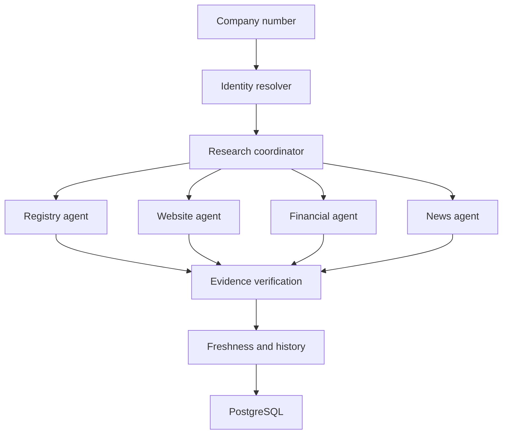

# Signalpost AI

Evidence-first company intelligence for Norwegian businesses.

Signalpost accepts a nine-digit Norwegian registration number and produces a structured profile. The architecture treats sources as the system of record: deterministic retrieval and extraction happen before identity and evidence verification. Unsupported values remain absent rather than guessed.

## Architecture



## Quick start

```bash
python -m pip install -r requirements.txt
uvicorn signalpost.app.main:app --reload
python -m signalpost.app.cli.main research 912345678 --json
```

`docker compose up --build` starts the API, PostgreSQL, and Redis services. External source adapters are intentionally conservative and never bypass authentication, CAPTCHAs, paywalls, robots rules, or other access restrictions. Configure provider credentials only through environment variables.

## API

- `GET /health`
- `POST /research` with `{ "company_number": "912345678" }`
- `GET /research/{run_id}`
- `GET /companies/{company_number}`

## Batch, validation, and tests

```bash
python scripts/research_companies.py --input data/input/demo_companies.csv --output data/output/profiles.jsonl
python scripts/validate_dataset.py data/output/profiles.jsonl
pytest -q
```

The batch runner is checkpointed by company number and can resume without duplicating completed rows. `data/input/demo_companies.csv` is only deterministic development data; a competition dataset must be imported from a permitted public source and is not fabricated by this repository.

## Limitations and reproducibility

The included registry adapter is a safe boundary and does not invent registry responses when a live source is unavailable. Add permitted source adapters under `signalpost/app/sources/`, then connect their extracted documents to the verification pipeline. This keeps benchmark results honest and reproducible.
