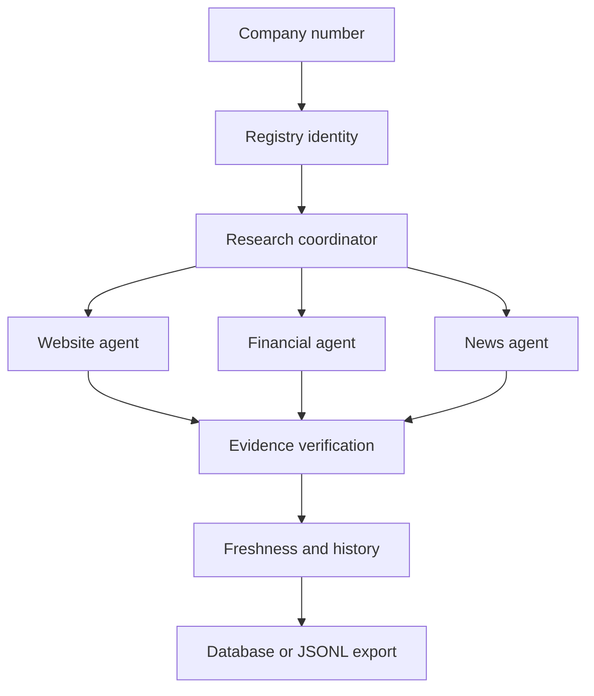

# Signalpost AI

Evidence-first company intelligence for Norwegian businesses.

Signalpost accepts a Norwegian organisation number and returns a structured profile. It deliberately separates retrieval, deterministic extraction, identity matching, evidence verification, and persistence. Unsupported values are represented as `null`/`not_found`; the system never asks an LLM to invent financial or registration data.

## Architecture



## Quick start

```bash
python -m pip install -r requirements.txt
python -m signalpost.app.cli.main research 912345678 --json
uvicorn signalpost.app.main:app --reload
```

Or run the full local stack:

```bash
docker compose up --build
```

The API is available at `http://localhost:8000`, with OpenAPI documentation at `/docs`.

## CLI and batch processing

```bash
python -m signalpost.app.cli.main research 912345678
python -m signalpost.app.cli.main research 912345678 --json
python -m signalpost.app.cli.main batch data/input/demo_companies.csv --output data/output/profiles.jsonl
python scripts/research_companies.py --input data/input/demo_companies.csv --output data/output/profiles.jsonl --concurrency 4
python scripts/validate_dataset.py data/output/profiles.jsonl
python scripts/benchmark.py --input data/output/profiles.jsonl
python scripts/export_profiles.py --input data/output/profiles.jsonl --output-dir data/output
```

Batch output is checkpointed by company number. Re-running the command skips completed records and failed companies are isolated from the rest of the batch.

## API

- `GET /` service metadata
- `GET /health` health check
- `POST /research` with `{ "company_number": "912345678" }`
- `GET /research/{run_id}` retrieve an in-memory run
- `GET /companies/{company_number}` convenience research endpoint

## Source and evidence policy

Adapters use public, permitted sources only and enforce request timeouts, bounded response sizes, URL validation, and explicit identity signals. Authentication, paywalls, CAPTCHA, robots restrictions, and private data are never bypassed. Every accepted fact should retain a source URL, quoted evidence, publication date when available, and retrieval date.

The included `StaticRegistrySource` is a deterministic offline adapter for development and tests. Connect permitted live adapters under `signalpost/app/sources/` before using a competition dataset; this repository does not fabricate a 1,000-company dataset.

## Development

```bash
make install
make test
make lint
make format
make validate
make benchmark
```

Tests are deterministic and do not call external services. PostgreSQL and Redis are included in Compose for deployment parity; the current offline coordinator can run without them.

## Limitations

The current default source set is intentionally offline and conservative. Live registry, website, financial, and news adapters must be configured with an approved source and tested against its terms. Benchmark outputs are computed from actual JSONL input and are never hard-coded.

- No legitimate 1,000+ company competition dataset is bundled or fabricated.
- Demo benchmarks are local smoke tests and are not representative of 1,000-company performance.
- Live external source availability can affect downstream facts and evidence coverage.
- When sources fail or do not support a claim, Signalpost keeps the value absent/partial rather than fabricating it.
- Docker configuration is provided, but runtime validation depends on Docker being available in the execution environment.
