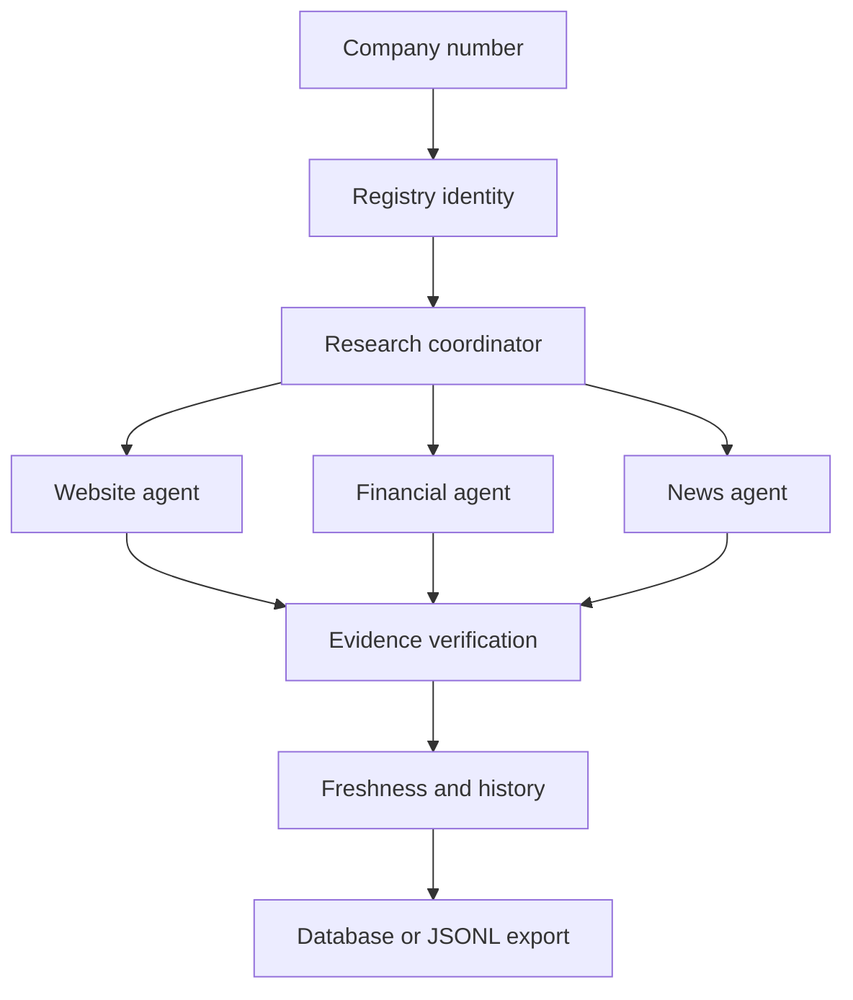

# Signalpost AI

Evidence-first company intelligence for Norwegian businesses.

# Builderr Submission Information

## 1. Company Profiles

Signalpost includes at least 1,000 completed company/organization research profiles. The completed profiles are distinct from profiles containing verified company facts.

- Canonical dataset: 1,174,930 valid unique Norwegian organization numbers
- Benchmark profiles: exactly 1,000
- Benchmark output: `data/output/profiles-1000.jsonl`
- Benchmark result:
  - 1,000 processed
  - 1,000 complete
  - 0 partial
  - 0 failed
  - 84 records with verified facts
  - 916 zero-fact records
  - 100% evidence coverage for extracted facts

The benchmark therefore contains 1,000 completed research profiles, of which 84 contain verified facts; it does not claim that all 1,000 profiles contain verified company facts.

## 2. Repository

Repository URL: https://github.com/Sayandevxyz/Signalpost-AI.git

## 3. Exact Commit Hash

```text
Commit: 0ec4a1b2467bb46dbcfedd82fc084886190a06aa
```

Signalpost accepts a Norwegian organisation number and returns a structured profile. It deliberately separates retrieval, deterministic extraction, identity matching, evidence verification, and persistence. Unsupported values are represented as `null`/`not_found`; the system never asks an LLM to invent financial or registration data.

## Architecture



## Quick start

```bash
python -m pip install -r requirements.txt
python -m signalpost.app.cli.main research 912345678 --json
uvicorn signalpost.app.main:app --reload
```

Or run the full local stack:

```bash
docker compose up --build
```

The API is available at `http://localhost:8000`, with OpenAPI documentation at `/docs`.

## CLI and batch processing

```bash
python -m signalpost.app.cli.main research 912345678
python -m signalpost.app.cli.main research 912345678 --json
python -m signalpost.app.cli.main batch data/input/demo_companies.csv --output data/output/profiles.jsonl
python scripts/research_companies.py --input data/input/demo_companies.csv --output data/output/profiles.jsonl --concurrency 4 --metrics-output data/output/benchmark-metrics.json
python scripts/validate_dataset.py data/output/profiles.jsonl
python scripts/benchmark.py --input data/output/profiles.jsonl
python scripts/export_profiles.py --input data/output/profiles.jsonl --output-dir data/output
```

Batch output is checkpointed by company number. Re-running the command skips completed records and failed companies are isolated from the rest of the batch.

## API

- `GET /` service metadata
- `GET /health` health check
- `POST /research` with `{ "company_number": "912345678" }`
- `GET /research/{run_id}` retrieve an in-memory run
- `GET /companies/{company_number}` convenience research endpoint

## Source and evidence policy

Adapters use public, permitted sources only and enforce request timeouts, bounded response sizes, URL validation, and explicit identity signals. Authentication, paywalls, CAPTCHA, robots restrictions, and private data are never bypassed. Every accepted fact should retain a source URL, quoted evidence, publication date when available, and retrieval date.

The included `StaticRegistrySource` is a deterministic offline adapter for development and tests. Connect permitted live adapters under `signalpost/app/sources/` before using a competition dataset. The canonical organization-number input is generated from the official Brønnøysundregistrene Enhetsregisteret export at `data/input/norwegian_companies.jsonl`; `data/input/dataset_manifest.json` records its retrieval metadata, checksum, counts, and NLOD 2.0 attribution. Contains data under the Norwegian Licence for Open Government Data (NLOD) distributed by Brønnøysundregistrene. Enhetsregisteret contains organizations/entities, so the dataset does not assert that every entity is a commercial company. Downloaded raw exports under `data/raw/` are intentionally ignored.

To reproduce the import, download the official totalbestand CSV, then run:

```bash
python scripts/import_brreg_dataset.py --input data/raw/enhetsregisteret.csv
python scripts/validate_dataset.py --input data/input/norwegian_companies.jsonl
```

Validation requires exactly nine numeric digits per organization number, no malformed records, and no duplicates. The completed benchmark used exactly 1,000 organization research runs from the canonical dataset, with checkpointing and resume exercised. Results are stored at `data/output/profiles-1000.jsonl` and summarized in `data/output/benchmark.json`.

## Development

```bash
make install
make test
make lint
make format
make validate
make benchmark
```

Tests are deterministic and do not call external services. PostgreSQL and Redis are included in Compose for deployment parity; the current offline coordinator can run without them.

## Limitations

The current default source set is intentionally offline and conservative. Live registry, website, financial, and news adapters must be configured with an approved source and tested against its terms. Benchmark outputs are computed from actual JSONL input and are never hard-coded.

- The canonical dataset contains organization numbers from the official Enhetsregisteret export; it is not a claim that every entity is a commercial company.
- The exact 1,000-company benchmark completed with 1,000 records, 84 verified facts, and 916 zero-fact records. Zero-fact records are retained research runs and are not described as successful fact extraction.
- Benchmark instrumentation supports latency, throughput, request, retry, timeout, rate-limit, checkpoint, LLM and cost metrics. Metrics unavailable from the selected execution configuration are reported as unavailable rather than inferred.
- LLM/token/cost metrics were not applicable to this run because the no-LLM configuration was used. Latency and request metrics were not captured for this existing benchmark artifact and are reported as unavailable.
- Live external source availability can affect downstream facts and evidence coverage.
- When sources fail or do not support a claim, Signalpost keeps the value absent/partial rather than fabricating it.
- Docker configuration is provided. Docker runtime validation could not be performed in the available environment because Docker was not installed.
